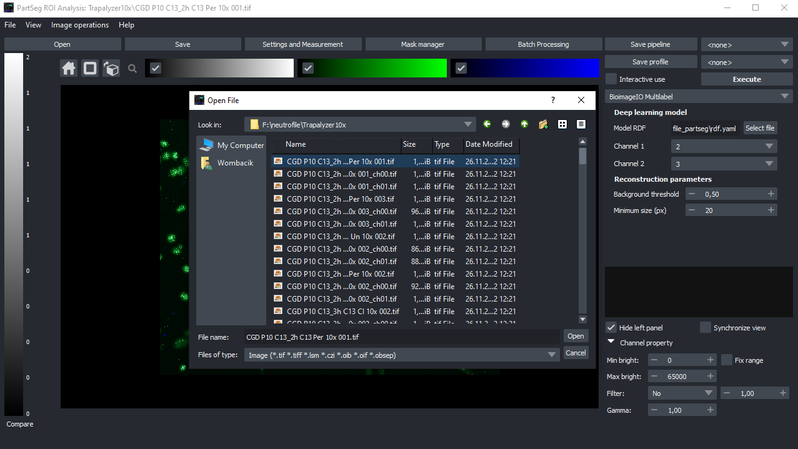
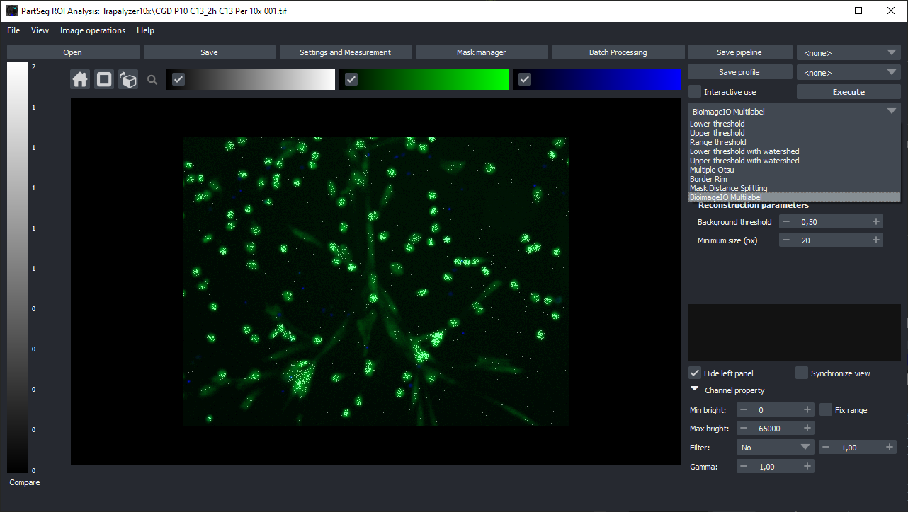
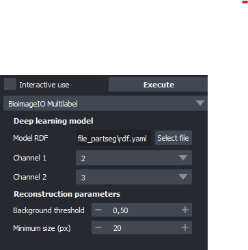
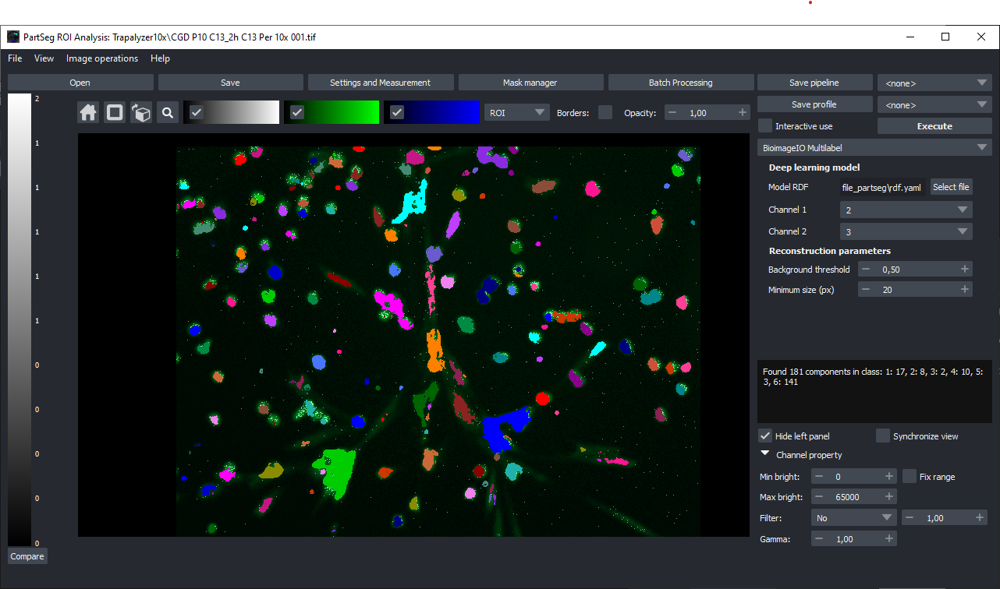

# How to use bioimageio model in PartSeg

`This tutorial requires full implement of interface for screenshots`

1. Ładowanie danych do PartSega przez przeciągniecie
2. wybranie z listy dostępnych metod segmentacji metodę z tej paczki
3. wybranie modelu z dysku
4. ustawienie parametrów rekonstrukcji
5. uruchomienie segmentacji
6. analiza wyników

Powiedzenie, że można uzyć w batchprocessingu i ostrzerzenie o tym, że jeżeli instalacja pytorcha używa cudy,
to trzeba uważać na pamięć GPU.

## Download model

Open [bioimage.io](https://bioimage.io/) and select model that you would like to test on your data. We will use our [model](put_link) for segment neutrofile 

After download model from website unpack model. 

## Prepare data

To load the data user could drag and drop the file to PartSeg window or use `File->Open` menu.
In this tutorial we will use the image from [Zenodo](https://zenodo.org/record/7335430).

Open one of images from selected dataset:

## Model selection

On the top of the right panel select Bioimageio multilabel method:

Use "Select file" button to select `rdf.yaml` file from already selected model.
After PartSeg parse model parameters, based on model description select which channel from image constains data expected by model. 

You could Also adjust "Reconstruction Parameters" for remove artificial objects recognized by algorithm. 

The Background Threshold is used for confidential level above which output of 
deep learn model is treated as true (from range 0-1)

Minimum size is responsible for removing objects smaller than given size in px.

After set channels click **Execute** button and wait for result. 

.

The information how to convert this to batch processing could be found in PartSeg official [documentation](https://partseg.readthedocs.io/en/latest/interface-overview/interface-overview.html#batch-processing)