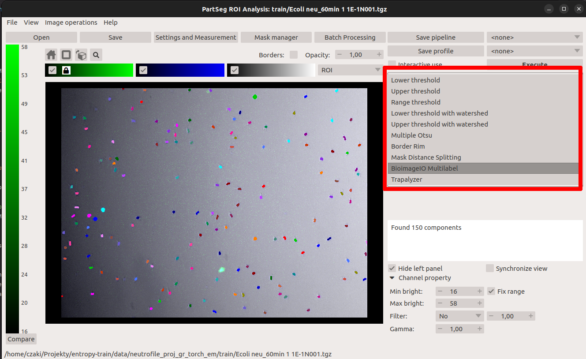

---
jupyter:
  jupytext:
    formats: ipynb,md
    text_representation:
      extension: .md
      format_name: markdown
      format_version: '1.3'
      jupytext_version: 1.14.1
  kernelspec:
    display_name: Python 3 (ipykernel)
    language: python
    name: python3
---

# Disclaimer
This tutorial shows how to improve data labeling using deep learning on PartSeg output. In this version, we train the model using publicly available infrastructure based on the Google Colab environment. The version of how to use local computational services is in `train_model_server.md`


# How to improve data labeling using deep learning on PartSeg output

This tutorial discusses training a new deep learning model based on (semi)automatic segmentation methods' output.

PartSeg provides several (semi)automatic segmentation methods (see Fig. below). They can segment an input dataset, but achieving the best results requires human supervision. For example, the Gauss noise filtering method requires the user to select a Gauss radius and whether the Gauss will be calculated per layer or on the whole image.

Batch segmenting interesting objects using (semi)automatic methods is usually faster than training a custom model for a given data type. 
But it is not always possible. Several set of parameters may be required, and data could not be easily partitioned. 
Or it may not be possible to use semiautomatic methods because of the high noise level for part of data. Then Deep learning may be a good solution. As it is not a problem to add artificial noise to data, it is possible to use (semi)automatic method for preparing train data.

This tutorial presents how a user could use the output from previous segmentations done with PartSeg to train a deep-learning model. Then a user could add such a model to PartSeg and use it fully automated to automatically segment similar datasets from the GUI interface and use PartSeg measurement to extract knowledge.



<!-- There are multiple scenarios when having a working deep learning model could help:

1) Used (semi)automatic method requires using a given probe or marking objects that are not required in the experiment. Then Segmentation could be done on specially prepared data, but a model train only using the subset of channels. Because some methods have a limited number of channels, it may allow marking and investigating more objects important from the point of scientific question. For example, confocal microscopes allow using only four channels.

2) Sometimes, an available method requires some expensive (in the context of time) preprocessing steps like deconvolution.

3) Collecting data with a low noise ratio may require access to limited and expensive infrastructure. However, collecting only data needed for the model training may be much more straightforward than collecting all experiment data. Then, the preprocessing phase could add artificial noise before starting the train. -->

The data sets for this tutorial are available on [zenodo](https://zenodo.org/record/7335430). When training machine learning models it is important to split data into two parts *Train* and *Test*. The size of *Train* should be 80-90% od data, and *Test* should contain 10-20% of the data. Such approach allows to counteract model overfiting, i.e., obtaining models adapted too much to the particular input data set, but not working in general. When training algorithms on own data set it is important to also split them in such a way. It is also important that the data is cleaned, that is it does not contain errors nor omissions. The sample data we provide with this tutorial was aready cleaned and split. It is organized into 3 folders:

* *Train* - data for train
* *Test* - data for test
* *Problematic* - data with a high number of artifacts. Could be used for manual verification the model.

Each folder contains PartSeg projects with contains images and segmentations. The raw data on which this dataset is build is also available on [zenodo](https://zenodo.org/record/7335168).


## Google Colab

Run following code only if execute notebook on google colab to setup environment

```python
# First, make sure that you are using a GPU. For this, go to:
# Runtime->Change runtime type and select Hardware accelarator->GPU
# When you then run this cell you should see a gpu status overview
# (if something went wrong you will see an error message)
!nvidia-smi
```

```python
# Install conda in your google drive session
!pip install -q condacolab
import condacolab
condacolab.install()
```

```python
# workaround for bug in conda-forge
!ln -s /usr/lib/x86_64-linux-gnu/libfontconfig.so.1 /usr/lib/libfontconfig.so
```

```python
# update mamba
!mamba update mamba
```

```python
# install required libraries
!mamba install -y -c pytorch -c conda-forge python-elf dask bioimageio.core PartSeg==0.14.6 npe2==0.2.2
```

```python
!pip install --no-deps kornia
!pip install --no-deps git+https://github.com/constantinpape/torch-em
!pip install --no-deps git+https://github.com/czaki/PartSeg_bioimageio
```

```python
EXPORT_PATH = "exports"
```

```python
# mount your google drive to permanently save data
from google.colab import drive
drive.mount("/content/gdrive")
EXPORT_PATH = "/content/gdrive/MyDrive/exports"
```

```python
import os

data_path = os.path.join("data", "neu")
```

To download data from zenodo please execute the following cell:

```python

import zipfile
import tempfile
from urllib import request

def download_and_unpack_data():
    if os.path.exists(data_path) and os.listdir(data_path):
        return
    with tempfile.TemporaryDirectory() as temp_dir:
        print(temp_dir)
        zip_path = os.path.join(temp_dir, "ecoli_neu_PartSeg_projects.zip")
        request.urlretrieve("https://zenodo.org/record/7335430/files/ecoli_neu_PartSeg_projects.zip?download=1", zip_path)
        os.makedirs(data_path)
        with zipfile.ZipFile(zip_path) as zip_ref:
            zip_ref.extractall(data_path)

download_and_unpack_data()

```

It this tutorial we use [torch_em](https://github.com/constantinpape/torch-em) as a wrapper around [pytorch](https://pytorch.org/). Please read its installation [instructions](https://github.com/constantinpape/torch-em#installation). To keep readability of this document part of code is mooved out to `PartSeg_bioimageio.train_util` module.

```python
import numpy as np
import torch
import torch_em.transform
from torch_em.model import UNet2d

from PartSeg_bioimageio.train_util import get_partseg_loader

```

Network parameters:

```python
NETWORK_DEPTH=4
NETWORK_INITIAL_FEATURES=32
PATCH_SIZE=256
BATCH_SIZE=8
ITERATIONS=500
SAVE_ROOT="./checkpoint"
```

PartSeg allows for ROI Extraction (Data labeling) algorithm to return multiple labeling
of data for better visualization. The required one is "ROI" in which each component is marked with separate number.

In the [Trapalyzer](https://github.com/Czaki/Trapalyzer) that is used for generate labeling in this project following additional labeling are provided:

* PMN neu: polymorphonuclear, unstimulated neutrophils
* RND neu: cells with decondensed chromatin and rounded nucleus
* RUP neu: neutrophils with ruptured nuclear envelope
* PER neu: neutrophils with a permeabilized plasma membrane
* Bacteria: e-coli bacteria
* NET: neutrophile net
* Unknown intra: not classified objects for intracellurar probe
* Unknown extra: not classified objects for extracellular probe
* Labeling: Each class of objects are represented by a single number

In this tutorial we would like to create model that will predict to which class belong a given object. Because of this we will use "Labeling" as input to model

```python
NAME_OF_ROI_LABELING="Labeling"
```

Because first four class that we want to diverse are different phases of same cell type we decide to use one hot encoding.
Bellow is function that transform "Labeling" array into 7 channel image. (*TODO dodać informacje o wykrywaniu krawędzi jeśli zadziała*)

```python
def trapalyzer_label_transform(labels):
    one_hot = np.zeros((7,) + labels.shape, dtype="float32")
    for i in range(1, 6):
        one_hot[i][labels == i] = 1
    one_hot[6][labels == 8] = 1  # NET
    one_hot[0][(labels == 0) | (labels > 8)] = 1  # Background
    return one_hot
```

```python
def get_train_and_val(data_dir, patch_size, batch_size):
    train_loader = get_partseg_loader(
        data_dir,
        patch_shape=(patch_size, patch_size),
        batch_size=batch_size,
        split="train",
        label_transform=trapalyzer_label_transform,
        label_name=NAME_OF_ROI_LABELING,
    )
    val_loader = get_partseg_loader(
        data_dir,
        patch_shape=(patch_size, patch_size),
        batch_size=batch_size,
        split="test",
        label_name=NAME_OF_ROI_LABELING,
        label_transform=trapalyzer_label_transform,
    )
    return train_loader, val_loader
```

```python
model = UNet2d(
    in_channels=3,
    out_channels=7,
    depth=NETWORK_DEPTH,
    initial_features=NETWORK_INITIAL_FEATURES,
)
train_loader, val_loader = get_train_and_val(data_path, PATCH_SIZE, BATCH_SIZE)

MODEL_NAME = "neutrofile_model"

trainer = torch_em.default_segmentation_trainer(
    name=MODEL_NAME,
    model=model,
    train_loader=train_loader,
    val_loader=val_loader,
    learning_rate=1e-4,
    device=torch.device("cuda"),
    save_root=SAVE_ROOT,
)
trainer.fit(iterations=ITERATIONS)
```

## Model exporting

Used framework require additional export steep to save model in bioimageio format. The export steep need to be done on same machine as train because of hardcoded path.

```python
from torch_em.util.modelzoo import export_bioimageio_model

DOCUMENTATION = "Text with model documentation"

export_bioimageio_model(
    os.path.join(SAVE_ROOT, "checkpoints", MODEL_NAME),
    os.path.join(EXPORT_PATH, MODEL_NAME),
    name=MODEL_NAME,
    description="neutrofile model",
    authors=[{"name": "Grzegorz Bokota"}],
    license="MIT",
    documentation=DOCUMENTATION,
    git_repo="https://github.com/Czaki/PartSeg_bioimageio/",
    cite="",
    maintainers=[{"github_user": "czaki"}],
    tags=[
        "2d",
        "unet",
        "fluorescence-light-microscopy",
        "cells",
        "pytorch",
        "semantic-segmentation",
        "ilastik",
    ],
)
```
